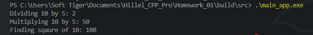

# Hillel C++ Pro - Homework
### 1st homework:
 - create simple math library with static methods (divide, multiply, square);
 - create main.cpp file that uses this library;
 - link it all together with CMake and build the project; 
[Result](https://github.com/antontrushst/Hillel_CPP_Pro/tree/main/Homework_01): 

